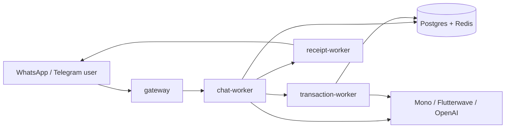

# Nenya AI Banking Agent

Nenya AI is a production-shaped conversational banking backend for Nigerian users. It lets people link bank accounts, check balances, query transactions, move money, buy airtime/data, manage beneficiaries, schedule payments, and request receipts through WhatsApp and Telegram.

The project focuses on the hard parts of AI-assisted fintech systems: typed task planning, durable conversation state, multi-account funding, idempotent money movement, provider abstraction, queue-backed workers, mobile-first chat rendering, and multilingual conversation handling.

> **Important:** This repository is a backend/system design project. Local and smoke-test flows should use seeded users and mock or sandbox providers, never real-money accounts.

## 1. At A Glance

- **Channels:** WhatsApp and Telegram ingress with provider-specific webhook validation and presentation.
- **Banking surface:** account linking, balances, transaction queries, transfers, airtime, data, beneficiaries, schedules, receipts, support, and FAQs.
- **Account model:** BVN-based onboarding and cross-bank account linking, not a single-wallet flow.
- **Execution model:** typed planner output, domain workers, durable interrupts, idempotent financial execution, and async notification delivery.
- **User experience:** mobile-first message bodies, structured WhatsApp/Telegram rendering, typing heartbeats, semantic routing, and deterministic fast paths.
- **Languages:** English, Nigerian Pidgin, Yoruba, Igbo, Hausa, and mixed phrasing.

## 2. The Request Lifecycle (Top-to-Bottom)

When a user sends a message like *"Send 5k to Adebayo and buy 2k airtime"*, here is exactly how it flows through the system:



1.  **Ingress (`gateway`)**: The message hits our webhook. The gateway validates the provider (Meta/Telegram), normalizes the payload, and drops it onto a Redis stream (`chat:messages`).
2.  **Ingestion & Orchestration (`chat-worker`)**: The worker consumes the stream and invokes the **Orchestrator** graph (built on LangGraph). Here, the message is routed, and for complex requests, the Planner LLM breaks the text into typed tasks (e.g., `transfer` and `airtime`).
3.  **Interrupts (Blockers)**: If a task needs a PIN, confirmation, or missing data (like an account number), execution pauses securely.
4.  **Financial Action (`transaction-worker`)**: Once authorized, tasks are published to financial Redis streams. The `transaction-worker` executes them idempotently against external providers.
5.  **Egress (`receipt-worker`)**: Success or failure triggers the receipt worker, rendering a receipt and sending a notification back to the user.

## 3. The Hard Parts Explained

The codebase is structured to bridge conversational ambiguity with strict, idempotent financial execution. Here are the core concepts you need to grasp:

### A. The Two DAGs (Control Flow vs. Task Flow)
The system operates using two distinct Directed Acyclic Graphs (DAGs):
1. **The Control-Flow DAG (LangGraph)**: The static lifecycle of a single message turn (`ingest` -> `gate` -> `plan` -> `advance` -> `finalize`). It ends when it needs to wait for the user.
2. **The Task DAG (Dependency Waves)**: Dynamically generated by the Planner. Independent tasks run in the same **Wave**. Dependent tasks run in subsequent waves.

### B. Routing Escalation: Gate vs. Semantic Router vs. Planner
Routing is layered by confidence and cost:
1. **Gate (Deterministic Fast Paths)**: Rule-based matching. Bypasses the LLM. It *must* decline if it's unsure.
2. **Semantic Router**: A lightweight LLM classification step. It decides the *shape* of the route (e.g., is "what about yesterday?" a new request or a query continuation?). It picks the domain but does not build the payload.
3. **Planner**: The heavy LLM process used when the request is mixed or highly ambiguous. It extracts entities and builds strictly typed `TaskSpecs`.

### C. Interrupts, Blockers, and Pausing State
The system cannot execute tasks if details are missing. It uses a **PendingInterrupt** to park the state.
* **Priority**: `Missing Input` > `Confirmation` > `Auth (PIN)`.
* If a wave has two tasks, and one needs missing input while the other is ready for a PIN, the system suppresses the PIN request until all tasks in the wave are ready.

### D. Memory, Context, and "Stale State Stealing"
To support terse follow-ups (e.g., "show me the second one"), we use **Context Frames**.
* **The Danger:** An old receipt or support context might "steal" a brand new request.
* **The Fix:** Stale context arbitration. If a user's message contains new transactional slots or is clearly a fresh request, the Semantic Router forces the system to drop the old ephemeral state.

### E. Safe Money Movement & Idempotency
* **Funding Review**: Before asking for a PIN, the system checks if the default or selected accounts have enough money. It can perform **Pooled Funding** (combining funds from multiple linked accounts).
* **Idempotency Keys**: Every financial action is bound to a unique idempotency key. Any edit to a pending transfer (e.g., changing the amount) *immediately* invalidates all prior funding and PIN authorization state, generating new idempotency keys.

## 4. Quick Start

Use the Makefile/uv path for normal development:

```bash
make setup
make local-stack-migrate
```

Create `.env` from local secrets before starting the stack. For local testing with existing Postgres and Redis containers, set `DATABASE_URL` and `REDIS_URL`, then run:

```bash
make local-stack
```

Useful quality commands:

```bash
make lint
make format-check
make test
```

`make type-check` is available as a convenience target, but check its Makefile scope before treating it as strict repo-wide enforcement. For more detail, see [Local Development](docs/local-development.md).

## 5. Documentation Map & Deep Dives

Start with [Glossary](docs/glossary.md) if terms like gate, planner, wave, interrupt, idempotency, or context frame are unfamiliar.

| Need | Start Here |
|---|---|
| Project-specific terms and examples | [docs/glossary.md](docs/glossary.md) |
| Service boundaries, Redis streams, runtime flow | [docs/architecture.md](docs/architecture.md) |
| End-to-end conversation lifecycle, routing, workers, safety, sessions, and progress | [docs/conversation-runtime.md](docs/conversation-runtime.md) |
| LangGraph lifecycle, interrupts, task execution | [docs/orchestrator.md](docs/orchestrator.md) |
| Top-level graph DAG, task waves, blocker arbitration | [docs/dag-and-orchestration-internals.md](docs/dag-and-orchestration-internals.md) |
| Gate stages, semantic routing, planner handoff | [docs/gate-and-routing.md](docs/gate-and-routing.md) |
| Transfers, pooled funding, auth, refunds, receipts | [docs/money-movement.md](docs/money-movement.md) |
| Accounts, queries, bills, beneficiaries, schedules, support | [docs/domains.md](docs/domains.md) |
| Setup, local stack, tests, readiness scripts | [docs/local-development.md](docs/local-development.md) |
| Screen-recording demo script | [docs/demo.md](docs/demo.md) |
| Deployment, env vars, observability, runbooks | [docs/operations.md](docs/operations.md) |

## 6. Repository Layout & Tech Stack

**Tech Stack**
| Layer | Technology |
|---|---|
| Language | Python 3.11+; MyPy configured for Python 3.12 |
| API | FastAPI + Uvicorn |
| Orchestration | LangGraph / LangChain |
| Database | PostgreSQL 16 |
| Cache / Transport | Redis 7 and Redis Streams |
| Providers | Mono, Flutterwave, OpenAI, mock providers |
| Infra | Docker Compose, optional AWS S3 storage |
| Quality | Ruff, MyPy, Pytest |

**Repository Layout**
```text
banking_agent/
+-- apps/
|   +-- gateway/         # webhooks, ingress, channel adapters
|   +-- chat/            # orchestration, planning, conversational runtime
|   +-- transaction/     # financial worker runtime
|   +-- receipt/         # receipt rendering and notifications
+-- banking/             # product core, policy, presentation, runtime, repositories
+-- shared/              # infrastructure primitives and provider clients
+-- docs/                # architecture, operations, domain, and local development docs
+-- tests/               # regression and integration tests
+-- data/                # FAQ and runtime seed content
+-- alembic/             # database migrations
+-- docker-compose.yml   # canonical local/VPS runtime shape
+-- deploy-stack.sh      # canonical stack entrypoint
+-- pyproject.toml
```

## 7. Code Navigation

| Area | Start Here |
|---|---|
| Orchestrator | `apps/chat/src/agent/orchestrator/agent.py` |
| Graph workflows | `apps/chat/src/agent/orchestrator/workflows/` |
| Task planner + semantic routing | `apps/chat/src/agent/orchestrator/workflows/planner/` |
| Query worker | `banking/transactions/query/worker.py` |
| Account worker | `banking/accounts/management/worker.py` |
| Transfer worker | `banking/transfers/worker.py` |
| Bills workers | `banking/bills/airtime/worker.py`, `banking/bills/data/worker.py` |
| Beneficiary worker | `banking/beneficiaries/worker.py` |
| Account linking | `banking/accounts/onboarding/` |
| Structured message bodies | `shared/messaging/body_blocks.py` |
