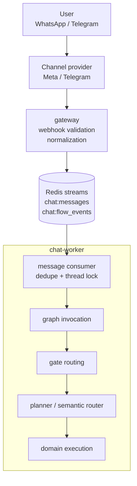
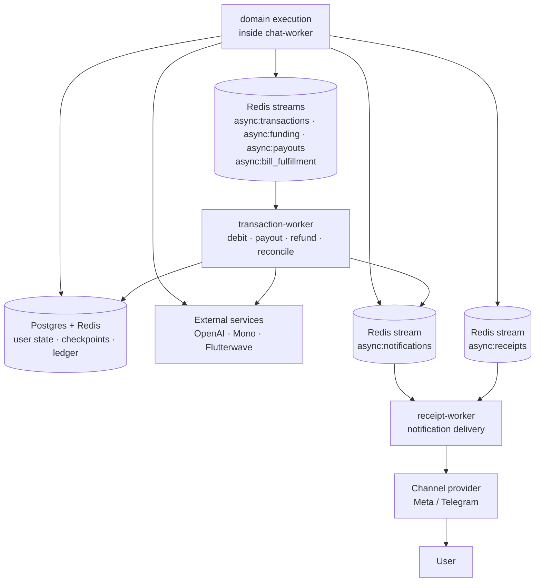

# Architecture

This document explains the runtime boundaries, message ingress path, Redis stream contracts, shared infrastructure, and provider dependencies for the Nenya AI banking agent.

For deploy/runbook detail, see [Operations](operations.md). For graph internals, see [Orchestrator](orchestrator.md).

## Terms Before You Read

See [Glossary](glossary.md) for the full vocabulary. This page uses these terms most:

| Term | Meaning here |
|---|---|
| Service boundary | The ownership line between deployed runtimes. One service can request work, but the owning service is responsible for executing it. |
| Worker | A runtime that consumes queues or owns a class of work, such as chat processing or financial execution. |
| Redis stream | The queue transport used for durable handoff between runtimes. |
| Handoff | Moving work from one owner to another through a stream message. |
| Provider | An external API dependency, such as WhatsApp, Telegram, Mono, Flutterwave, or OpenAI. |
| State | Durable data in Postgres or Redis that survives process restarts and async handoffs. |

Example: the `chat-worker` can decide that a transfer is ready, but it hands financial execution to `transaction-worker` through a Redis stream. That keeps conversation ownership separate from provider-side money movement.

## Runtime Boundaries

| Runtime | Owns |
|---|---|
| `gateway` | WhatsApp/Telegram webhooks, provider verification, inbound event normalization, inbound work publishing |
| `chat-worker` | Chat-critical queues, per-thread locking, LangGraph invocation, gate/planner/execution, scheduled transaction dispatch |
| `transaction-worker` | Financial async queues, debit/payout/bill/refund/reconciliation execution |
| `receipt-worker` | Receipt rendering and outbound notification delivery |

Do not run multiple stacks against the same logical queue ownership. Redis streams are durable handoff points, but database rows are the workflow source of truth for financial execution.

## Inbound Message Flow

Plain chat messages enter as `message.received` on `chat:messages`. WhatsApp Flow callbacks, Telegram callbacks, and PIN resumes enter as `flow_event.process` on `chat:flow_events`.

After gateway normalization, `chat-worker` claims the Redis stream record, applies dedupe and the per-thread lock, then invokes the orchestrator graph.

## Runtime Handoffs

Visible replies are published to `notification.send` on `async:notifications`. Money-moving work branches from chat execution to financial streams consumed by `transaction-worker`; completion and failure messages return through the same notification path.

## Queue And Stream Contracts

Queue contracts live in `shared/queue/contracts.py`.

| Logical Topic | Redis Stream | Primary Owner |
|---|---|---|
| `message.received` | `chat:messages` | `chat-worker` |
| `flow_event.process` | `chat:flow_events` | `chat-worker` |
| `notification.send` | `async:notifications` | `receipt-worker` |
| `receipt.process` | `async:receipts` | `receipt-worker` |
| `transaction.execute` | `async:transactions` | `transaction-worker` |
| `funding.process` | `async:funding` | `transaction-worker` |
| `funding.reconcile` | `async:funding_reconciliation` | `transaction-worker` |
| `payout.process` | `async:payouts` | `transaction-worker` |
| `payout.reconcile` | `async:payout_reconciliation` | `transaction-worker` |
| `bill.fulfill` | `async:bill_fulfillment` | `transaction-worker` |
| `bill.reconcile` | `async:bill_reconciliation` | `transaction-worker` |
| `refund.process` | `async:refunds` | `transaction-worker` |
| `refund.reconcile` | `async:refund_reconciliation` | `transaction-worker` |
| `transaction_debit.process` | `async:transaction_debits` | `transaction-worker` |
| `transaction_debit.reconcile` | `async:transaction_debit_reconciliation` | `transaction-worker` |
| `transaction_debit.refund` | `async:transaction_debit_refunds` | `transaction-worker` |
| `transaction_debit.refund_reconcile` | `async:transaction_debit_refund_reconciliation` | `transaction-worker` |
| `direct_transfer.reconcile` | `async:direct_transfer_reconciliation` | `transaction-worker` |
| `ledger.reconcile.postings` | `async:ledger_posting_reconciliation` | `transaction-worker` |
| `ledger.reconcile.exposure` | `async:ledger_exposure_reconciliation` | `transaction-worker` |

## Shared Infrastructure

- **Postgres:** users, linked accounts, transactions, transaction mirror coverage, funding rows, ledger rows, support tickets, and durable financial status.
- **Redis:** streams, locks, latest inbound dedupe, LangGraph checkpoints, short-lived conversation state, and async queue transport.
- **Provider clients:** Mono for open banking, Flutterwave for payments/bills, OpenAI for planner/semantic parsing, and mock providers for local/test flows.

## Important Invariants

- Gateway validates and normalizes inbound events; chat-worker owns conversational interpretation.
- Domain workers are product modules invoked inside chat execution, not separately deployed services.
- Financial execution is async and idempotent; chat should not directly mutate provider financial state outside the worker contracts.
- Completion, failure, and receipt messages are delivered through the notification pipeline.
