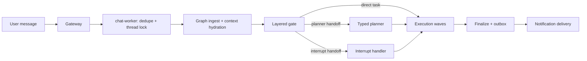

# Conversation Runtime Guide

This is the current end-to-end guide to how Nenya AI receives a banking message, decides what it means, protects money movement, executes work, and replies. It is the best starting point for product, engineering, demo, and incident discussions.

For deployment topology, see [Architecture](architecture.md). For the exact graph and task-DAG implementation, see [DAG and Orchestration Internals](dag-and-orchestration-internals.md). For money-specific rules, see [Money Movement](money-movement.md).

## What the system owns

The system is a conversational banking runtime, not a free-form chatbot with tools attached. Natural language is used to understand user intent, but every banking effect is reduced to typed state, a registered operation, and an explicit safety gate before it can run.

It supports these primary domains:

| Domain | Examples | Typical safety boundary |
|---|---|---|
| Transactions and analytics | lists, totals, income/spending, details, evidence | read-only query contract |
| Accounts | balances, linked accounts, default account, link/unlink | confirmation for account mutations |
| Beneficiaries | count/list, handoff to transfer, rename/delete | reviewed ID-backed mutation |
| Transfers | send money, recipient/funding review, batch transfer | confirmation and PIN |
| Airtime and data | plan search, purchase, scheduling | confirmation and PIN for purchase |
| Schedules | list, runs, create, edit, cancel, pause, resume | review; PIN where required |
| Support and receipts | ticket status, notes, closure, receipt delivery/replay | confirmation for ticket closure |
| FAQ | retrieval-backed product help | read-only |

Unsupported capabilities are policy-blocked rather than guessed. The capability policy decides what is enabled; the canonical operation registry decides which enabled operations can exist at all.

## One inbound turn



The gateway normalizes WhatsApp, Telegram, callbacks, and media events. `chat-worker` deduplicates the inbound message, obtains a per-thread lock, starts the typing heartbeat, hydrates context, and invokes the LangGraph orchestrator. The graph produces an outbox; delivery is asynchronous and never grants financial authority.

The top-level graph is built in `apps/chat/src/agent/orchestrator/graph/builder.py` and has these nodes:

```text
ingest -> gate -> plan | handle_interrupt | advance | finalize | end
```

Every conditional edge reads one value only: `turn_directive.next_step`. The graph does not infer control flow from a response string, task list, wave index, or pending interrupt.

## Canonical turn routing

`TurnDirective` is the authoritative routing contract for the current turn. It is created through the canonical factory/materializer in `apps/chat/src/agent/orchestrator/models/turn_directive.py`.

| Field | Meaning |
|---|---|
| `owner` | Component that made the decision: guardrail, semantic router, planner, query session, or interrupt handler |
| `decision` | Stable semantic reason, such as `domain_account`, `planner_handoff`, or `cancel` |
| `outcome_kind` | `direct_response`, `task_dispatch`, `planner_handoff`, `interrupt_handoff`, or `policy_block` |
| `next_step` | The only graph instruction: `plan`, `handle_interrupt`, `advance`, `finalize`, or `end` |
| `target_domain`, `mode`, `source`, `path_shape` | Typed context for execution, telemetry, and debugging |

`RouteResolution` pairs that directive with the state patch. It rejects attempts to override controlled routing fields. This prevents one layer from silently changing a route chosen by another.

Flat labels such as `routing_owner` remain telemetry projections for dashboards, not routing authority. Legacy controls such as `direct_path_triggered` and `semantic_path_shape` must not drive graph edges.

## Layered routing: why there are several layers

Layered routing is intentional. Different layers solve different certainty and safety problems:

1. **Guardrails and deterministic stages** handle narrow, safe cases cheaply: explicit cancel, language switch, expired PIN callbacks, numeric choices, known UI/context selectors, and high-confidence fast paths.
2. **Context arbitration** deterministically checks expiry, protected interrupts, strict selectors, and the bounded eligible-frame bundle. It does not call a separate model.
3. **Semantic router** is one bounded LLM call when natural-language meaning needs interpretation. It chooses the domain, fresh versus continuation mode, read shape, explicit filters, policy block, direct reply, planner handoff, and—when a frame is eligible—a sparse continuation delta resolved locally against stable references.
4. **Planner** is used for genuinely ambiguous, mixed, batch, or orchestration-heavy requests. It creates typed tasks and dependency waves; it does not execute money movement.

No layer is allowed to control graph transitions independently. They contribute evidence, then commit a directive.

### Semantic router versus planner

The semantic router answers: “What kind of turn is this, and can one domain handle it?”

The planner answers: “What typed work must be built, in what order, with what executor-specific parameters?”

Examples:

| User turn | Expected owner | Outcome |
|---|---|---|
| “How much is in Access?” | semantic router or deterministic account path | one account read task |
| “Show the second one” after a list | context/query resolver | continuation task |
| “Send 5k to Mum and buy data” | planner | typed mixed task wave |
| “Cancel” while confirming | interrupt handler | terminal cancellation response |
| “Can you do crypto?” | policy guard/router | policy block, no task |

The semantic router may produce a bounded conversational response for casual, capability, clarification, and out-of-scope turns. It is validated and has deterministic localized fallback; the system does not call a second responder after a successful semantic-router reply.

## Typed reads and conversational memory

Read operations use a shared presentation contract, `ReadRequest`:

```text
subject + response_shape + explicit filters + offset/page_size
```

Subjects include transactions, balances, linked/default accounts, beneficiaries, schedules, tickets, and receipts. Shapes distinguish facts (`fact_count`, `fact_bool`, `fact_value`, `fact_status`) from lists, details, and actionable surfaces.

Workers execute this contract rather than reinterpreting the original message. A fact answer stays concise; “show them” turns the retained request into a list using the same filters.

Successful reads create privacy-limited context frames. Frames store stable references, masked labels, normalized contracts, page position, and expiry metadata—not hidden full result payloads. They support “show them,” “next,” “previous,” ordinal selection, refinements, and detail requests. Fresh requests replace their own domain frame; unrelated work does not automatically erase a useful frame.

Transaction queries additionally maintain specialized query contracts, result surfaces, clarification state, historical frames, and short-lived recently closed read-only context. Query calculations, pagination, coverage, and evidence are deterministic once the query contract is known.

## Workers and the operation registry

Domain workers are invoked inside the chat execution runtime. They are not graph owners and cannot write checkpoints or select a graph edge.

The canonical registry in `banking/runtime/operations.py` defines every executable operation:

- domain and executor;
- canonical action name;
- typed parameter and result models;
- risk class: `READ_ONLY`, `MUTATION`, or `MONEY_MOVE`;
- confirmation/PIN requirements; and
- capability-policy action.

Task materialization validates operations against the registry before execution. Runtime capability policy can disable or explain an operation, but cannot expose an unregistered operation. This keeps planner output, semantic direct tasks, workers, policy, and tests in parity.

Workers return typed results: successful read/action output, missing information, reviewed confirmation data, authorization requirements, async handoff details, or safe failure. The orchestrator turns those results into state patches, blockers, and outbox messages.

## Sessions, checkpoints, and state

LangGraph checkpoint state is the short-lived source of truth for a live conversation. Important state includes:

| State | Purpose |
|---|---|
| `tasks`, `waves`, `current_wave_index` | Current typed work and dependency order |
| `pending_interrupt` | One durable blocker awaiting the user |
| `turn_directive` | Current turn’s authoritative route and next step |
| `session_stack` / `stashed_sessions` | Active and paused domain flows |
| query session and recent query context | Query continuation and brief post-close read-only recovery |
| context frames and referent memory | Safe follow-up grounding |
| authorization context | PIN authority bound to exact transaction work |

Checkpoints are not a financial ledger. Long-lived financial state belongs in Postgres and provider-side records. Legacy checkpoint hydration drops obsolete routing authority rather than reconstructing it; the next inbound turn generates a fresh directive.

An interruption such as “What is my GTB balance?” may pause a pending transfer, run the account read, then offer safe resumption. A fresh replacement request can supersede stale conversational context, but it never reuses prior authorization.

## Interrupts, confirmation, and authorization

An interrupt is a durable request for one user action. The system persists one live `PendingInterrupt` at a time. When a wave produces several blockers, the priority is:

```text
missing input > confirmation > authorization
```

This ensures that the user is never asked for a PIN before required details and final review are complete.

Common interrupt purposes:

- missing recipient, account, bank, schedule detail, or selection;
- beneficiary, recipient, funding, or schedule review;
- confirmation of a mutation or money movement;
- PIN/auth for eligible financial operations;
- query clarification where a safe deterministic answer needs one missing field.

The interrupt handler first applies narrow deterministic logic, then uses typed semantic interpretation only where safe. Confirmation and authorization turns are deliberately protected from broad re-routing. Approvals, corrections, cancellation, and valid slot fills either advance the existing waves, dispatch an explicit replacement, or hand off to the planner when genuinely mixed.

### Money movement safety

For transfer, airtime, and data purchases, the normal path is:

```text
extract -> resolve/validate -> recipient or funding review -> final confirmation -> PIN -> idempotent execution
```

Any material edit—amount, recipient, source account, or funding—invalidates stale review, funding, authorization context, and idempotency bindings. Authorization is scoped to the exact reviewed task IDs and idempotency keys; a general `pin_verified` flag is never enough to execute work.

Financial execution is handed to the transaction worker through async streams. The conversation worker reports authoritative pending/complete/failure outcomes but does not silently retry or claim provider success without the relevant result.

## Language and localization

Supported response locales are English, Nigerian Pidgin, Yoruba, Hausa, and Igbo. Catalog-backed copy is generated from typed message keys and checked for completeness.

An explicit language request is persisted and locked as user preference. Otherwise, a confident LLM language signal controls the current response; persistent automatic preference changes use hysteresis to avoid flapping. The resolved locale is applied to state and any delayed progress update in the same turn. Explicit language switching preserves live financial state rather than cancelling it.

Locale logs use privacy-safe identifiers. Unsupported language claims must not be added to prompts unless catalogs, parsing, and product support are added together.

## Typing heartbeat and visible progress

Typing and visible progress are separate:

- **Typing heartbeat:** starts immediately for accepted inbound turns, refreshes every four seconds for up to 60 seconds, and stops before final outbox enqueue. It does not wait for an LLM or a progress stage.
- **Visible progress:** opportunistic, localized status copy for genuinely long work. It is not emitted for normal fast reads, clarifications, or pre-confirmation collection.

Visible progress uses registered operation stages in `banking/runtime/progress.py`; workers do not infer progress from raw text. Query and transfer stages remain specialized. Eligible long-running account, beneficiary, schedule, support, and authorized airtime/data operations can set one safe stage.

The first visible update waits two seconds, the second waits seven seconds, and a turn can send at most two. Before a progress message is sent, delivery waits a 750 ms settle window. If the final response becomes ready, or the stage changes, the old progress update is suppressed. Final-response delivery is never delayed to create an artificial gap.

## Observability and performance

Every turn emits privacy-safe route and latency telemetry. Useful fields include directive owner/decision/path shape, LLM event chain, call count, token and schema size, provider prompt-cache telemetry, and total duration.

Readiness scenarios can enforce call and token ceilings for deterministic and known single-call paths. Complex paths can be marked observational until measured. Provider prompt-prefix caching remains useful; Redis exact-response caching is intentionally not used.

When investigating a conversation issue, inspect in this order:

1. inbound message, turn directive, and `next_step`;
2. active interrupt/session/context frames and their expiry;
3. canonical task action and operation-registry risk gates;
4. worker result and blocker arbitration;
5. authorization/idempotency state for a financial mutation;
6. ordered LLM event chain and latency budget; and
7. final outbox plus delivery result.

Never log raw account numbers, bank identifiers, transaction references, candidate payloads, or unmasked user data in these diagnostics.

## Where to change the system

| Concern | Primary location |
|---|---|
| Graph transitions and directive contract | `apps/chat/src/agent/orchestrator/graph/`, `models/turn_directive.py` |
| Gate stage registry and semantic routing | `workflows/gate/` |
| Planner prompts, schemas, normalizers | `workflows/planner/` |
| Interrupt application and resumption | `workflows/interrupt/` |
| Task execution and blocker arbitration | `workflows/execution/` |
| Canonical worker operations | `banking/runtime/operations.py` |
| Domain progress registry | `banking/runtime/progress.py` |
| Transaction query semantics | `banking/transactions/query/` |
| Locale/catalog rendering | `banking/presentation/i18n/` |
| Financial execution queues | `apps/transaction/`, `shared/queue/` |
| Deterministic readiness and latency audit | `scripts/readiness.py`, `tests/` |

Before changing a control path, update the directive/operation contracts and focused tests first. Do not add raw-text keyword rules merely to repair one transcript; encode typed state, domain contracts, or semantic prompt rules where the behavior belongs.
