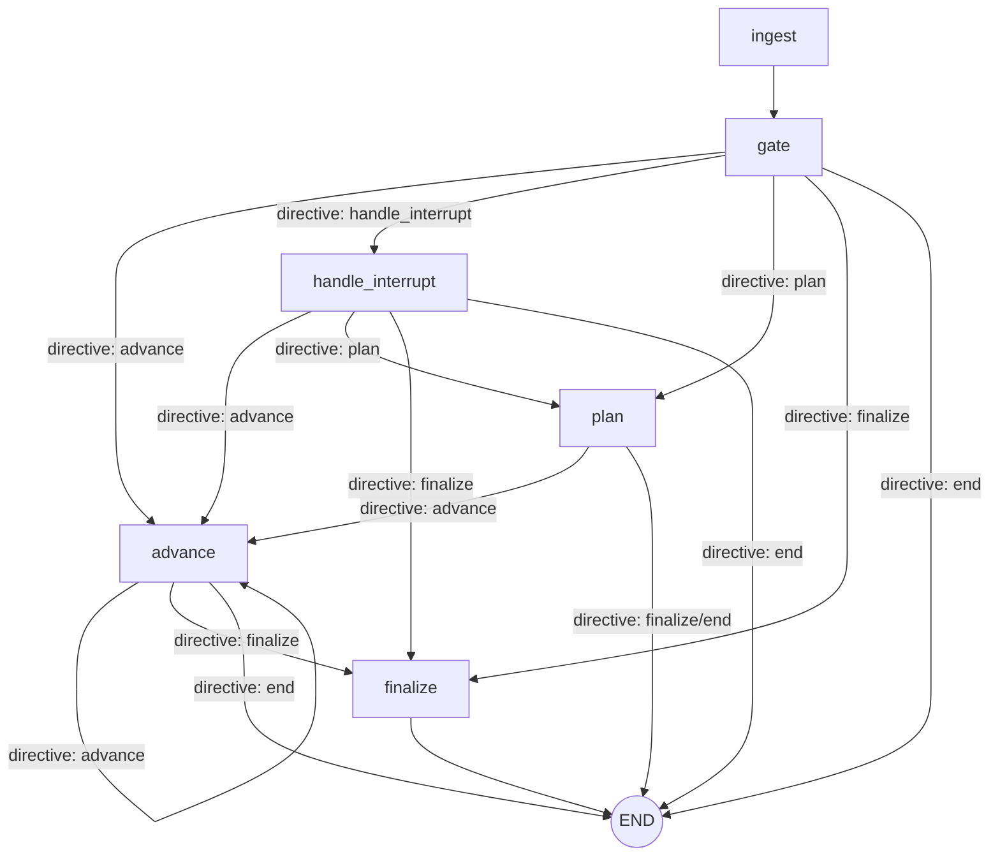

# DAG And Orchestration Internals

This document explains the two DAGs inside the chat orchestrator:

- the fixed LangGraph control-flow DAG that decides which orchestrator node runs next;
- the per-turn task dependency DAG that groups planned tasks into execution waves.

For the current end-to-end lifecycle, see [Conversation Runtime Guide](conversation-runtime.md). For the higher-level graph lifecycle, see [Orchestrator](orchestrator.md). For route classification and gate stage order, see [Gate And Semantic Routing](gate-and-routing.md).

## Terms Before You Read

See [Glossary](glossary.md) for the full vocabulary. This page uses these terms most:

| Term | Meaning here |
|---|---|
| DAG | A dependency graph where tasks point one way and dependencies run before dependents. |
| LangGraph | The library used to build the top-level control-flow graph for each inbound turn. |
| Node | A graph step such as `gate`, `plan`, or `advance`. |
| Edge | A route from one node to another. Conditional edges choose the route from current state. |
| `END` | The end of the current graph invocation, not the end of the conversation. |
| `TurnDirective` | The authoritative route committed for this turn; its `next_step` is the only graph transition control. |
| Wave | A group of task ids that can run after earlier dependency waves have completed. |
| Blocker | Something that stops execution until the user responds or approves. |
| `PendingInterrupt` | The saved blocker state, such as missing input, confirmation, or auth. |

Example: if an account lookup must run before two transfers, the lookup is wave 1 and both transfers can be wave 2. If those transfers then need a receipt summary, the summary becomes a later wave.

## Two DAGs

| DAG | Built by | Stored in | Purpose |
|---|---|---|---|
| LangGraph control-flow DAG | `build_orchestrator_graph(...)` | compiled graph plus checkpointed `OrchestratorState` | Move a turn through ingest, routing, planning, execution, interrupts, and finalization |
| Task dependency DAG | planner task-flow helpers | `OrchestratorState.tasks`, `waves`, `current_wave_index` | Run independent tasks together and dependent tasks after their prerequisites |

The control-flow DAG is stable code. The task DAG is dynamic data created from the current user turn.

The orchestrator owns durable state. Domain workers are stateless execution helpers: they receive typed task payloads and loaded context, then return results, prompts, patches, confirmations, receipts, or failure details. They do not own checkpoints or pending interrupts.

## Top-Level Graph

The compiled graph is built in `apps/chat/src/agent/orchestrator/graph/builder.py`.



The graph ends whenever the current turn has produced a visible response, has parked on a durable interrupt, or has finalized all work for the turn. Ending the graph does not mean the conversation is over; it means the current inbound event has been reduced into checkpoint state and outbox/final response state.

## Example Turn Walkthroughs

These examples are intentionally simplified; they show route shape, not every state update.

| User turn | Typical path | Why |
|---|---|---|
| "hi" | `ingest -> gate -> plan or END` | The turn can produce a direct conversational response without task execution. |
| "balance?" | `ingest -> gate -> advance -> finalize -> END` | The gate can build a direct balance/account task without asking the planner to decompose the request. |
| "send 5k" | `ingest -> gate -> plan -> advance -> END`, then resume later | The transfer task is missing recipient details, so execution creates a `PendingInterrupt` and waits for the user's answer. |
| "send 5k to Ada and buy 2k airtime" | `ingest -> gate -> plan -> advance ...` | Mixed work needs planner task construction, then execution waves handle each task according to dependencies and blockers. |
| "show the second one" after a transaction list | `ingest -> gate -> plan or advance` | The gate may ground the phrase against a context frame before choosing whether to answer, refresh, or build a task. |

## Node Responsibilities

| Node | Main responsibility | Typical next node |
|---|---|---|
| `ingest` | Normalize inbound message/callback state into `OrchestratorState` | `gate` |
| `gate` | Run deterministic guardrails, fast paths, context follow-ups, semantic routing, and planner handoff decisions | directive-selected `advance`, `handle_interrupt`, `plan`, `finalize`, or `END` |
| `handle_interrupt` | Apply the user reply to the live `PendingInterrupt` before normal planning/execution continues | directive-selected `advance`, `plan`, `finalize`, or `END` |
| `plan` | Produce non-task responses or build typed task specs and dependency waves from planner output | directive-selected `advance`, `finalize`, or `END` |
| `advance` | Execute one pass over the current task wave, then either loop, park on an interrupt, or finalize | directive-selected `advance`, `finalize`, or `END` |
| `finalize` | Reduce completed work into the final turn response/outbox behavior | `END` |

Important route checks:

- Every conditional graph edge reads only `turn_directive.next_step`.
- A missing or invalid directive is a routing-contract error; the graph never infers a route from `final_response`, tasks, waves, or `pending_interrupt`.
- Each node can replace the directive only through the canonical route-resolution/materialization path.
- Execution may emit `advance` for another wave, `finalize` for a visible result, or `end`; the worker result itself does not control a graph edge.

## Durable State Surface

`OrchestratorState` is the graph's checkpointed source of truth. The fields most relevant to the DAG are:

| Field | Role |
|---|---|
| `last_message_text`, `last_message_id`, `last_callback`, quote fields | Current inbound event surface |
| `normalized_instruction`, `planner_output` | Planner input/output record |
| `tasks` | Persistent `TaskSpec` map keyed by task id |
| `waves` | Topological groups of task ids; each wave can run after earlier waves complete |
| `current_wave_index` | Cursor into `waves` |
| `task_results` | Executor/domain artifacts accumulated by task id |
| `pending_interrupt`, `last_interrupt` | Current and previous durable user-blocking states |
| `outbox`, `final_response`, `policy_notice` | User-visible output and policy notice staging |
| `pin_verified`, `authorization_context` | Auth state; real authorization is bound to idempotency keys |
| `context_frames`, `referent_memory` | Read/context surfaces used for follow-ups and references |
| `turn_directive` | Authoritative owner, decision, outcome kind, and sole graph transition instruction for the current turn |
| `session_stack`, `active_domain`, `stashed_sessions`, `stashed_query_session` | Active and suspended flow/session context |
| `loaded_context`, `turn_context_summary` | Hydrated user/account context and compact turn summary |
| routing telemetry fields | Derived log/dashboard projections of the directive; not graph-control state |
| planner quality fields | `planner_used`, `planner_clean`, `planner_dirty_reasons`, `preplanner_expected_transaction_executors` |

The state object intentionally mixes long-lived conversation context with short-lived turn controls. The checkpoint serializer and lifecycle code are responsible for making old checkpoints survivable as schemas evolve.

## Planner To Task DAG

Planner-owned turns create task specs through the planner task-flow path:

```text
planner output tasks
  -> postprocess and quality checks
  -> capability filtering and batch limits
  -> optional query-session stash
  -> TaskSpec map
  -> dependency waves
```

`build_task_specs_and_waves_from_plan_items(...)` converts planner items into `TaskSpec`s. It then reads each spec's `depends_on` list and calls `build_dependency_waves(...)`.

`build_dependency_waves(...)` is a topological wave builder:

- task ids are kept in planner order;
- dependencies that do not point to known task ids are ignored;
- each wave contains tasks whose known dependencies were satisfied by earlier waves;
- if the dependency graph has a cycle, the remaining tasks are put into one fallback wave instead of crashing the turn.

Example:

```text
tasks:
  account_lookup
  transfer_a depends_on account_lookup
  transfer_b depends_on account_lookup
  receipt_summary depends_on transfer_a, transfer_b

waves:
  [account_lookup]
  [transfer_a, transfer_b]
  [receipt_summary]
```

The graph does not execute a child wave until `current_wave_index` advances past its dependencies.

## Execution Wave Loop

The `advance` node calls `advance_wave(...)`, which delegates to the execution wave engine. A single graph turn can loop through multiple waves if every wave completes without parking on an interrupt.

Execution wave phases:

| Phase | Meaning |
|---|---|
| `no_current_wave` | `current_wave_index` does not point at a wave |
| `pending_interrupt` | Execution is already blocked by a live interrupt |
| `recipient_review_block` | Recipient review must be shown before or after worker execution |
| `batch_funding_block` | Funding coordination must be resolved before or after worker execution |
| worker execution | Non-terminal tasks in the current wave are inspected and executed |
| `finalized` | Wave updates are reduced into state updates, blockers, or wave advancement |

Before workers run, the engine checks recipient review and batch funding. After workers run, it checks them again because worker results can create new review or funding demands.

During worker execution:

- tasks already `AWAITING_CONFIRMATION` are collected for confirmation gating;
- tasks already `AWAITING_AUTH` are collected for auth gating;
- tasks that should wait behind a live input interrupt are deferred;
- dependency status is applied before executor lookup;
- missing executors are skipped;
- mandate-gate failures are applied before executor execution;
- transaction tasks can propagate batch source-account selection to related tasks;
- if no task makes progress, deadlocked wave tasks are cancelled.

After worker execution, `finalize_execution_wave_updates(...)` chooses whether to park on a blocker, emit policy notice output, advance the wave cursor, or fail stalled tasks and advance.

## Blocker Arbitration

The orchestrator can persist only one `PendingInterrupt` at a time. If a wave produces several blockers, `choose_wave_blocker(...)` selects one by priority:

```text
input > confirmation > auth > none
```

This means missing required input suppresses confirmation/auth prompts from the same wave, and confirmation suppresses auth. Suppressed blockers are not ignored permanently; they remain represented by task stage and can be surfaced after the selected blocker is resolved.

Task ids are deduplicated while preserving current-wave order. Confirmation and auth gating also include tasks that share an async group id with selected tasks, so grouped money movement can be confirmed or authorized together.

## Interrupt And Resume Lifecycle

Interrupts are durable graph stops. They are represented by `PendingInterrupt` with kind `input`, `confirmation`, or `auth`.

Typical lifecycle:

```text
advance detects blocker
  -> build pending interrupt + prompt/outbox
  -> graph returns END
  -> user replies
  -> ingest loads checkpoint
  -> gate sees pending interrupt
  -> handle_interrupt applies reply
  -> route back to advance, plan, or END
```

`handle_pending_interrupt(...)` first runs pre-router deterministic handling. If that does not resolve the reply, it routes and applies an interrupt decision. Resolution may patch task payloads, clear or replace the pending interrupt, produce a final response, cancel work, or resume execution.

Important rules:

- confirmation and auth flows are protected from broad semantic reinterpretation;
- input interrupts can still use semantic routing where safe;
- graph END after an interrupt is expected behavior, not a failure;
- resuming after an interrupt uses the same `tasks`, `waves`, and `current_wave_index` checkpoint state.

## Context And Memory Surfaces

Context surfaces are part of routing and execution, not separate workflows. They help the system interpret follow-ups without letting stale state steal fresh requests.

Important surfaces:

| Surface | Purpose |
|---|---|
| `context_frames` | User-visible result/list/detail surfaces that can be referenced by follow-up turns |
| `referent_memory` | Short-lived entity memory extracted from context frames and tasks |
| `loaded_context` | Hydrated user/account/beneficiary context available to gate, planner, and execution |
| `turn_context_summary` | Compact summary used by semantic routing and planner prompt construction |
| `session_stack` and `active_domain` | Active flow/session hints for domain continuation |
| `stashed_sessions` and `stashed_query_session` | Suspended sessions that can be resumed after a fresh domain switch |

Gate stages arbitrate stale context before broad context follow-ups run. The key safety rule is that terse selectors can stay grounded in prior context, but fresh slot-bearing or non-terse requests should route semantically before old context is allowed to control the turn.

## Planner Handoff Contract

The gate controls whether the planner is needed; the planner controls typed task construction.

Gate-to-planner handoff should preserve:

- route metadata such as owner, decision, target domain, mode, source, and semantic path shape;
- expected transaction executor hints for mixed or ambiguous transaction requests;
- context summaries and loaded context needed by planner prompt construction;
- capability boundary and policy information when unsupported clauses were detected.

Planner task construction then applies postprocessing, quality checks, capability filtering, batch limits, and task wave creation. Non-task conversational or policy responses can set `final_response` and end the graph before execution.

## Debugging Stuck Or Misrouted DAGs

Start with the graph cursor and blocker state before reading prompts:

1. Check whether `pending_interrupt` exists and whether its `kind` matches the user-visible prompt.
2. Check `current_wave_index`, `waves`, and the task ids in the current wave.
3. Check each current-wave task's `stage`, `depends_on`, and key payload fields.
4. Check `turn_directive.next_step` to see why planner was bypassed or selected.
5. Check directive owner, decision, outcome kind, target domain, mode, source, and path shape.
6. Check `planner_output`, `planner_clean`, and `planner_dirty_reasons` when planner-owned work was expected.
7. Check `context_frames`, `referent_memory`, `stashed_query_session`, and stale context arbitration logs for context follow-up bugs.
8. Check `outbox`, `final_response`, and `suppress_empty_fallback` for turns that appear to finish silently.

Useful events:

- `route_plan_check`
- `advance_wave`
- `advance_wave_blocked_by_interrupt`
- `advance_wave_stalled_without_stop_condition`
- `wave_blocker_arbitrated`
- `handling_interrupt`
- `gate_engine_trace_summary`
- `gate_dispatch_to_planner`
- `gate_semantic_router_domain_dispatch`
- `orchestrator_turn_summary`
- `orchestrator_route_metrics`

## Code Map

| Area | Path |
|---|---|
| Graph construction | `apps/chat/src/agent/orchestrator/graph/builder.py` |
| Graph invocation/checkpoint handling | `apps/chat/src/agent/orchestrator/graph/` |
| Durable graph state | `apps/chat/src/agent/orchestrator/models/state.py` |
| Task and interrupt models | `apps/chat/src/agent/orchestrator/models/domain.py` |
| Planner task-flow build | `apps/chat/src/agent/orchestrator/workflows/planner/task_flow/task_flow_build.py` |
| Task spec and wave utilities | `apps/chat/src/agent/orchestrator/utils/task_payload.py`, `apps/chat/src/agent/orchestrator/utils/waves.py` |
| Execution wave node/engine | `apps/chat/src/agent/orchestrator/workflows/execution/node.py`, `apps/chat/src/agent/orchestrator/workflows/execution/wave/engine.py` |
| Wave task execution | `apps/chat/src/agent/orchestrator/workflows/execution/wave/runner_tasks.py` |
| Wave finalization | `apps/chat/src/agent/orchestrator/workflows/execution/wave/runner_finalize.py` |
| Blocker arbitration | `apps/chat/src/agent/orchestrator/workflows/execution/blocker_arbitration.py` |
| Interrupt handling | `apps/chat/src/agent/orchestrator/workflows/interrupt/` |
| Context frames and referents | `apps/chat/src/agent/orchestrator/context/`, `apps/chat/src/agent/orchestrator/workflows/planner/context/` |
